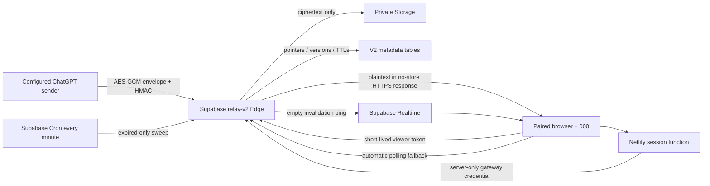

# Architecture and initial audit

Inspected on 2026-09-17 before implementation: GitHub main `4100ba3905409c40c4e8c00c52aaff5a19127c7e`, production Netlify deploy `6aaa498ed4d229964811995b`, deployed Supabase functions, public schema, table/function grants, Storage buckets and security advisors. No production patient rows or files were fetched.

## Actual V1 flow

The live site's HTML calls `relay-api`, a CORS proxy to `work-relay`. `work-relay` accepts a reusable access code in `x-relay-key`, returns plaintext from `relay_state`, and handles private `relay-files` uploads and signed downloads. The browser remembers the reusable credential in localStorage and polls every two seconds. Notes can be edited and saved. Upload validation trusts supplied MIME/extension; 12 MB is enforced in code while the bucket allows 50 MB. Signed links last an hour. No expiry exists.

`push-note` accepts GET parameters `v,s,i,d,sig`, verifies HMAC-SHA256, derives an AES-GCM key via PBKDF2, decrypts the incoming note, and overwrites the plaintext `relay_state.content`. One hardcoded secret is reused for push HMAC, encryption and viewing. There is no timestamp freshness check, replay cache or atomic version ordering. Exception logging can disclose internal details.

The repository's root `netlify.toml` instead publishes `public/`, with old `/push` and `/latest` Netlify Blob handlers. This is a different branch of the historical design: its `/latest` exposes encrypted blobs without authentication, and browser decryption uses the entered password. Rebuilding main as-is would not faithfully recreate the live site. Preserve the known production deploy, not an assumed rebuild of main, for rollback.

Other inspected remnants:

| Component | Finding | Disposition |
|---|---|---|
| `assistant-feed` | Fetches encrypted `relay/latest.json` from public GitHub and decrypts using caller-supplied password | Keep during preview; retire after cutover |
| `relay-ui`, `relay-ui-test` | Old embedded XHTML interfaces | Keep during preview; retire after cutover |
| `publish-relay-ui` | Unauthenticated endpoint writing fixed HTML into a public UI bucket | Keep during preview; retire after cutover |
| `relay_config` | RLS enabled; not used by deployed hardcoded access check | Retirement candidate |
| `relay_set_note(text)` | SECURITY DEFINER callable by anon/authenticated | EXECUTE revoked; function retained |
| `relay-web`, `relay-ui-public` | Public HTML buckets, not patient file buckets | Retirement candidates |
| duplicated root/relay HTML and Netlify Blob functions | Multiple previous mechanisms | Excluded from V2 bundle, retained pending approval |

## V2 boundaries

V2 has its own bucket `relay-v2-private`, `relay_v2_*` tables, `relay-v2` Edge Function, secrets, device credentials and preview origin. It shares the existing Supabase project's infrastructure and service-role trust boundary, but never reads or writes V1 patient tables/objects. This is logical isolation, not a separate paid Supabase project. A provider outage/resource exhaustion can affect both versions.

The only deliberate V1 change is the requested privilege revocation on the obsolete RPC. None of the inspected current frontend/Edge callers use that RPC; service-role direct writes remain unchanged. No V1 function, table, row, bucket, file, secret or frontend deployment was deleted/replaced.

## Data and transactions

- Notes: exact UTF-8 string encrypted with AES-256-GCM; envelope stored as a private object, never in a Postgres content column. After verifying HMAC, ingestion transiently decrypts in server memory to reject an invalid GCM tag, wrong key or malformed UTF-8 before replacing a working note. Only the encrypted envelope is persisted. Authenticated viewing decrypts in memory again. Replacement expires the previous object. No history endpoint exists.
- Filenames: encrypted metadata sidecar objects. Storage paths are random UUIDs with generic `data`/`meta` suffixes, never patient filenames.
- Files: private Storage objects with actual detected MIME. Browser access uses short-lived HMAC-signed Edge URLs; the Edge checks both signature and current object expiry before streaming. URLs contain no filename or note text and stop working immediately on logical deletion/expiry, even if physical sweeping is delayed.
- Postgres stores IDs, sizes, types, generic device labels, timestamps, version high-water mark, nonce hashes and auth metadata only. Supabase database backups do not include Storage object bytes; no application content backup/export mechanism is created. Provider retention is addressed in SECURITY.md.
- A row lock on the singleton state makes version acceptance/replay protection atomic. Concurrent same-version requests admit one winner. The high-water mark survives Clear/expiry.
- Clear includes the version displayed at click time. A newer note causes 409 and stays intact. Delete-all passes the IDs visible at confirmation time; later uploads survive.
- Pending uploads have a ten-minute cleanup deadline. Publication occurs only after Storage succeeds. Failed uploads/pushes are expired and swept, preventing abandoned private objects.
- File quota: 20 MiB per file, at most 40 live/pending files and 200 MiB total. Reservation is serialized to enforce the limit across concurrent devices.

## Live transport

Locally bundled Supabase Realtime client listens on a capability-named channel for **empty** `changed` messages. No patient content, file metadata, record identifier or note version is broadcast. The public Broadcast transport is only a wake-up hint; it grants no data access and is not an authorization boundary. A forged hint can only trigger a throttled authenticated refresh.

HTTP is authoritative. On WebSocket failure or disconnect, polling automatically runs every four seconds. While live, a 15-second reconciliation catches missed hints. Requests do not overlap; reconnect/visibility/online events trigger refresh. A failed HTTP request displays Offline even if WebSocket remains connected. Patient data has no browser persistent storage; sessionStorage holds only the expiring token and nonsensitive connection settings.
